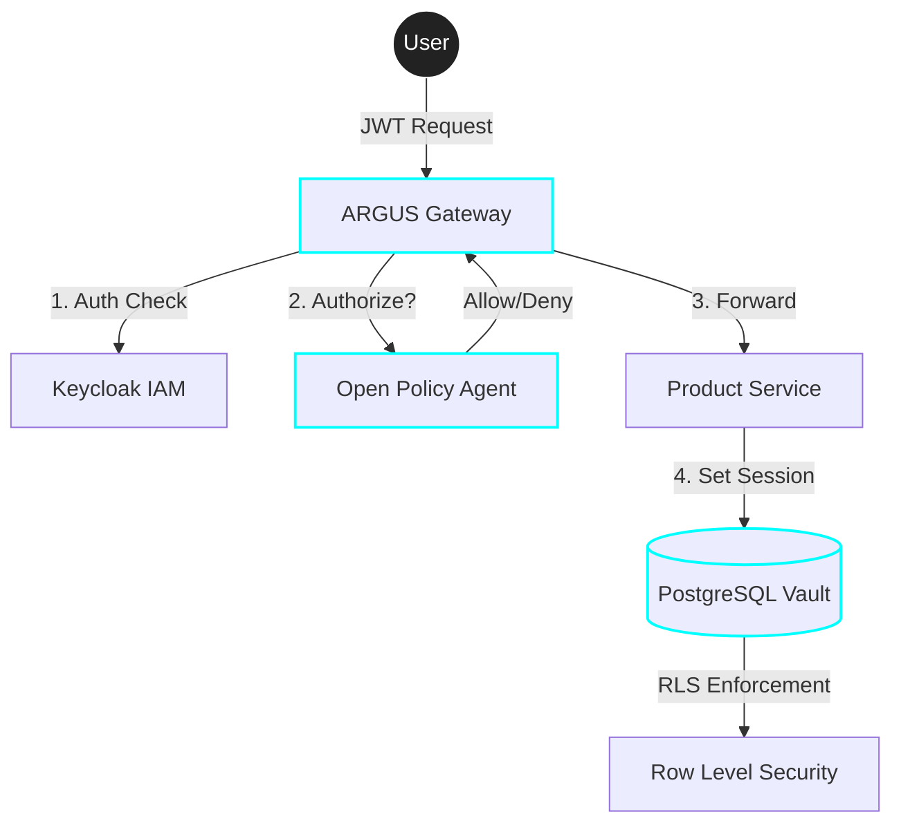

# 🛡️ Projeto Argus Gateway
## Enterprise Multi-tenant Cloud Infrastructure


*The unblinking sentinel of your microservices ecosystem.*

[](https://openjdk.org/)
[](https://spring.io/projects/spring-boot)
[](https://www.docker.com/)

---

## 🔍 Visão Geral
O **ARGUS Gateway** é uma infraestrutura de segurança distribuída projetada para aplicações SaaS modernas que exigem isolamento crítico de dados. Ele não apenas controla quem entra, mas garante que **nenhum dado vaze entre clientes (Tenants)** nas camadas mais profundas do sistema.

### 🏆 Diferenciais de Especialista
- **Zero-Trusted Data**: Isolamento nativo via **PostgreSQL Row-level Security (RLS)**.
- **Dynamic Governance**: Políticas de acesso via **Open Policy Agent (OPA)** (Rego).
- **Identity First**: Centralizado em **Keycloak** (OIDC/OAuth2).
- **High Performance**: Rate-limiting distribuído com **Redis**.

---

## 🏗️ Arquitetura do Sistema



---

## 🔐 Camadas de Blindagem (O "Cofre")

| Camada | Tecnologia | Função Principal |
| :--- | :--- | :--- |
| **Borda** | Spring Cloud Gateway | Filtro de entrada, auditoria e roteamento. |
| **Identidade** | Keycloak | Autenticação RSA256 e gestão de Claims de Tenant. |
| **Decisão** | OPA (Rego) | Polícia de acesso baseada em atributos (ABAC). |
| **Persistência** | Postgres RLS | Garantia matemática de que um Tenant nunca vê dados de outro. |

---

## 📄 Architectural Decision Records (ADR)

> [!IMPORTANT]
> **Por que Row-Level Security (RLS)?**
> A maioria dos sistemas tenta isolar dados no código Java (`where tenant_id = ?`). Isso é fatal se um desenvolvedor esquecer o filtro em uma nova query. Com **RLS**, o banco de dados impõe o filtro. Se o código falhar, o banco bloqueia. É a proteção máxima contra vazamento de dados.

---

## 🚀 Como Executar (Modo Showcase)

Basta um comando para subir todo o ecossistema pronto para ser testado:

```bash
# 1. Clone e entre na pasta
# 2. Suba o cofre blindado
docker compose up -d --build


---

## 🛠️ Stack Tecnológica
- **Backend:** Java 21, Spring Boot 3.2, Spring Cloud Gateway.
- **Segurança:** OPA (Open Policy Agent), Keycloak 24.
- **Database:** PostgreSQL 16 (RLS Enabled).
- **Cache/Quota:** Redis 7.
- **CI/CD:** GitHub Actions (Integrado).

---

Mantido com 🛡️ pela equipe **ARGUS Sentinel**.
