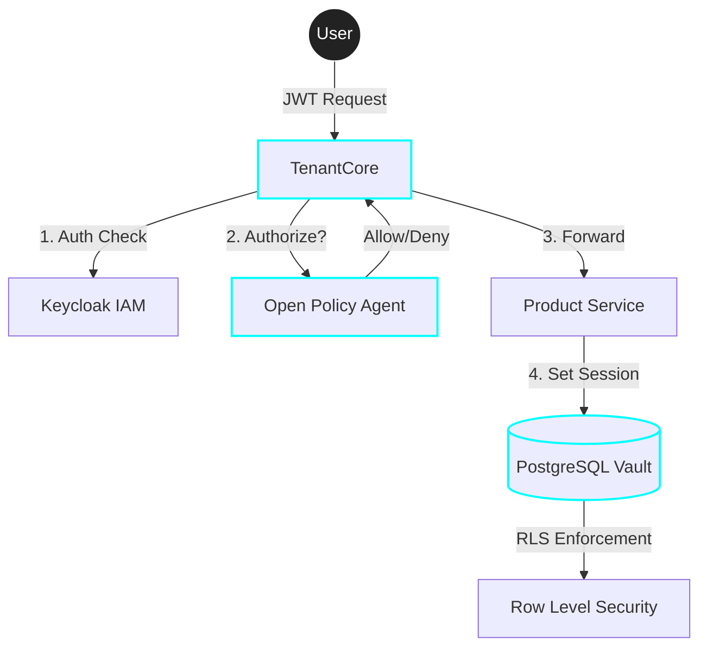

# 🛡️ Projeto TenantCore
## Enterprise Multi-tenant Cloud Infrastructure


*The unblinking sentinel of your microservices ecosystem.*

[](https://openjdk.org/)
[](https://spring.io/projects/spring-boot)
[](https://www.docker.com/)

---

## 🔍 Visão Geral

O **TenantCore** é uma infraestrutura de segurança distribuída projetada para aplicações SaaS modernas que exigem isolamento crítico de dados. Ele não apenas controla quem entra, mas garante que **nenhum dado vaze entre clientes (Tenants)** nas camadas mais profundas do sistema.

### 🏆 Diferenciais de Especialista

- **Zero-Trusted Data**: Isolamento nativo via **PostgreSQL Row-level Security (RLS)**.
- **Dynamic Governance**: Políticas de acesso via **Open Policy Agent (OPA)** (Rego).
- **Identity First**: Centralizado em **Keycloak** (OIDC/OAuth2).
- **High Performance**: Rate-limiting distribuído com **Redis**.

---

## 🏗️ Arquitetura do Sistema



---

## 🔐 Camadas de Blindagem (O "Cofre")

| Camada | Tecnologia | Função Principal |
| :--- | :--- | :--- |
| **Borda** | Spring Cloud Gateway | Filtro de entrada, auditoria e roteamento. |
| **Identidade** | Keycloak | Autenticação RSA256 e gestão de Claims de Tenant. |
| **Decisão** | OPA (Rego) | Polícia de acesso baseada em atributos (ABAC). |
| **Persistência** | Postgres RLS | Garantia matemática de que um Tenant nunca vê dados de outro. |

---

## 📄 Architectural Decision Records (ADR)

### 🛡️ Isolamento Nativo (RLS vs Filtros)

A maioria dos sistemas tenta isolar dados no código Java (`WHERE tenant_id = ?`). Isso é fatal se um desenvolvedor esquecer o filtro em uma nova query.

No **TenantCore**, usamos **Row-Level Security (RLS)**:

- **Segurança Garantida:** O banco de dados bloqueia o acesso mesmo se o código falhar.
- **Eficiência:** O isolamento acontece na camada mais profunda da persistência.
- **Expertise:** Demonstra domínio de recursos avançados do PostgreSQL.

#### Exemplo de Política no Postgres

```sql
-- O banco impõe o filtro automaticamente por Tenant
CREATE POLICY tenant_isolation_policy ON products
    USING (tenant_id = current_setting('app.current_tenant'));
```

---

## 🚀 Como Executar (Modo Showcase)

Basta um comando para subir todo o ecossistema pronto para ser testado:

```bash
# Clone e entre na pasta do projeto
# Suba todo o ecossistema (TenantCore, Auth, DB, OPA)
docker compose up -d --build
```

---

## 🛠️ Stack Tecnológica

| Camada | Tecnologia | Ícone |
| :--- | :--- | :--- |
| **Backend** | Java 21, Spring Boot 3.2 |  |
| **Borda** | Spring Cloud Gateway |  |
| **Segurança** | Keycloak 24 & OPA |  |
| **Database** | PostgreSQL 16 (RLS) |  |
| **Cache** | Redis 7 |  |

---

## 🔒 Security Showcase
O diferencial deste projeto é a **Defesa em Profundidade**. Você pode testar o isolamento tentando acessar dados de um Tenant A com um Token do Tenant B. O sistema bloqueará a requisição em **três níveis**:
1. **TenantCore:** O filtro OPA valida o `tenant_id` no JWT.
2. **Service:** O `TenantFilter` isola o contexto da thread.
3. **Banco de Dados:** O **RLS** garante que a query só retorne o que pertence ao Tenant logado.

---

Mantido com 🛡️ pela equipe **TenantCore Architects**.
